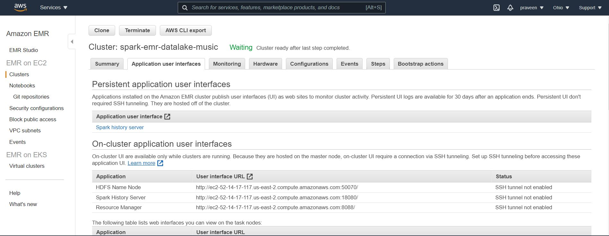

# Data Lake with Spark and EMR using Cloud9.
In this project we will implement the following:
- Use AWS S3 storage as Data Lake
- Building an ETL pipeline in Python for Music History data stored in Data Lake
- Load data from S3 and submit Spark jobs on EMR cluster using Cloud9 as environment to run the scripts.

# Introduction
A music streaming startup, Sparkify, has grown their user base and song database even more and want to move their data warehouse to a data lake. Their data resides in S3, in a directory of JSON logs on user activity on the app, as well as a directory with JSON metadata on the songs in their app.

As a data engineer, you were tasked to build an ETL pipeline that extracts their data from S3, processes them using Spark, and loads the data back into S3 as a set of dimensional tables. This will allow their analytics team to continue finding insights in what songs their users are listening to.

## Datasets
There are two datasets

**Song datasets**: all json files are nested in subdirectories under *s3a://s3bucket-spark-input/song_data*. 

Sample:

`
{"num_songs": 1, "artist_id": "ARD7TVE1187B99BFB1", "artist_latitude": null, "artist_longitude": null, "artist_location": "California - LA", "artist_name": "Casual", "song_id": "SOMZWCG12A8C13C480", "title": "I Didn't Mean To", "duration": 218.93179, "year": 0}
`

**Log datasets**: all json files are nested in subdirectories under *s3a://s3bucket-spark-input/log_data*.

Sample:

`
{"artist":null,"auth":"Logged In","firstName":"Walter","gender":"M","itemInSession":0,"lastName":"Frye","length":null,"level":"free","location":"San Francisco-Oakland-Hayward, CA","method":"GET","page":"Home","registration":1540919166796.0,"sessionId":38,"song":null,"status":200,"ts":1541105830796,"userAgent":"\"Mozilla\/5.0 (Macintosh; Intel Mac OS X 10_9_4) AppleWebKit\/537.36 (KHTML, like Gecko) Chrome\/36.0.1985.143 Safari\/537.36\"","userId":"39"}
`
## Schema

For this project, we will use Star Schema consisting of one **Fact** table and four **Dimensional** tables.

### Fact Table

- songplay
### Dimension Tables

- song
- users
- artists
- time

A simple star schema was employed for designing the tables.

<p align="middle">
  

## Files

The project includes 4 files:

- `spark_emr_execute_job` - creates EMR cluster with 1 master and 3 slave nodes and executes etl_music_job.py script
- `etl_music_job.py ` - This script reads song_data and load_data from S3, transforms them to create five different tables, and writes them to partitioned parquet files in table directories on S3
- `emr_bootstarp.sh` - installs necessary libraries on EMR cluster nodes when invoking a cluster.
- `terminate.sh` - This script is used to terminate the cluster

## How to run this project on AWS EMR using CLOUD9?

1. Upload emr_bootstrap.sh and etl_music_job.py scripts in S3 bucket under *s3a://s3bucket-spark-input*

2. Create Cloud9 environment in AWS, upload spark_emr_execute_job.sh and terminate.sh scripts to the project folder that you created and execute below commands.
  
```
chmod +x spark_emr_execute_job.sh
./spark_emr_execute_job.sh
```
  
<p align="middle">
  

3. Now go to EMR cluster in AWS console  and wait untill it finishes all jobs.

## Outputs
  
As soon as you ran step 2 script the following events can be observed in AWS EMR cluster.
  
### Cluster creation 
  
<p align="middle">
  
  
### Clustser Created
<p align="middle">
  
  
 when cluster is created, you can check the status of spark job.
 
 ### Spark Job Status
 <p align="middle">
  
  
 ### Spark Job Detail
  <p align="middle">
  
  
 ### Data Lake final output tables in S3
 Check the target S3 bucket and confirm that the tables have been written
  <p align="middle">
  

